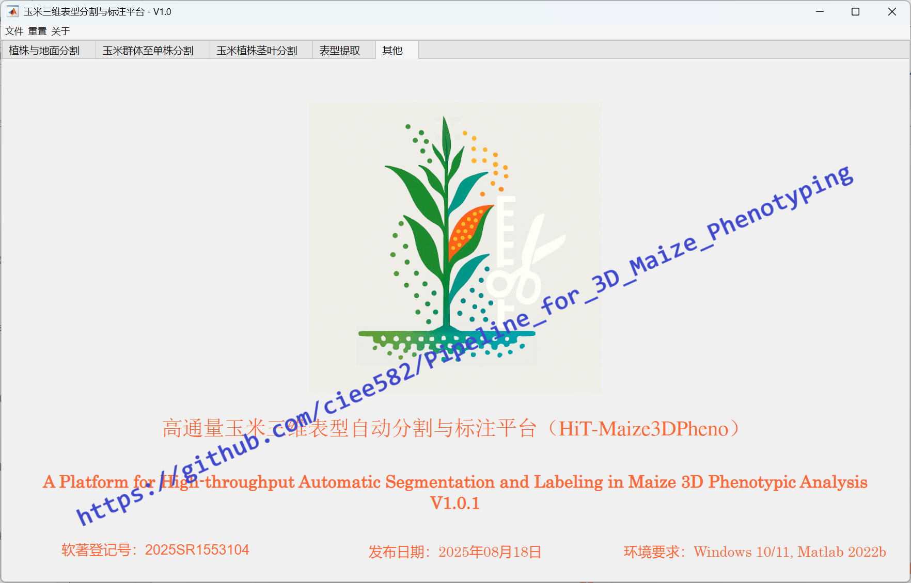
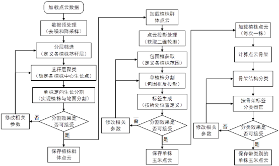
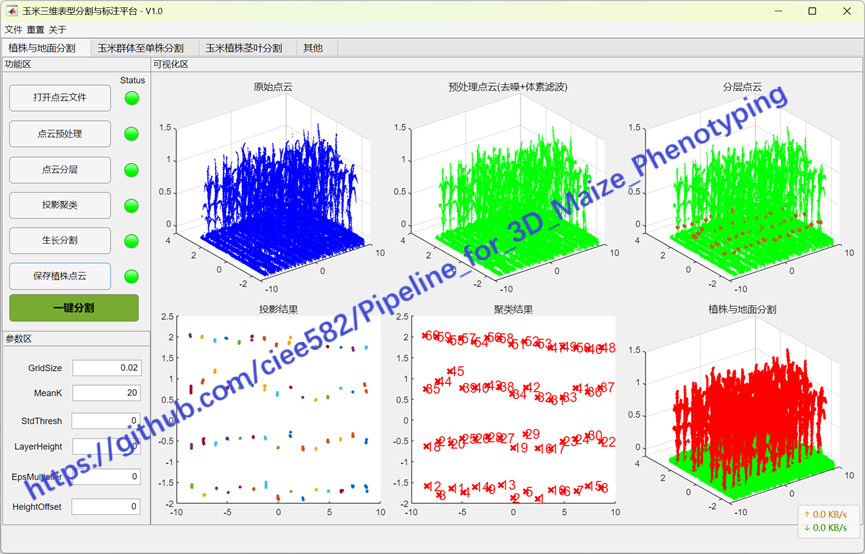
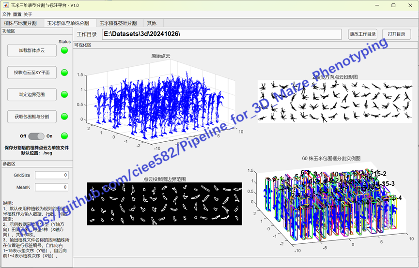
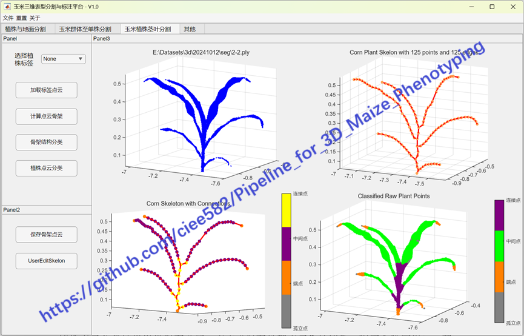
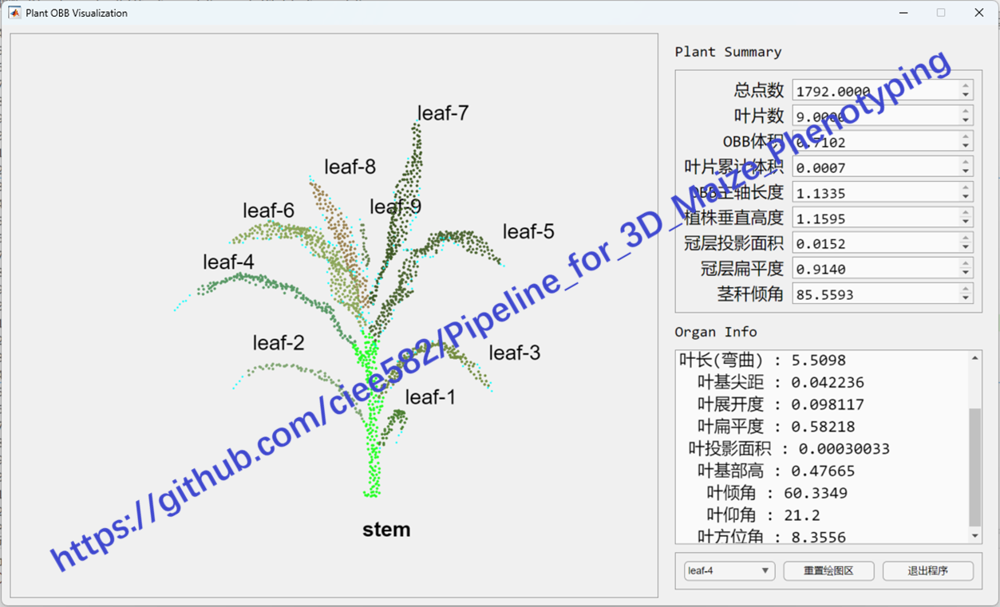

# Pipeline_for_3D_Maize_Phenotyping
This is a robust multi-level framework that integrates structure-aware ground filtering, density projection-based population separation, and skeleton-guided organ segmentation into a unified process.

The project documents are being compiled and will be uploaded and made public gradually. Please stay tuned, thank you!

【**Please note**： This software and related methods have been granted Chinese software copyright registration (No. 2025SR1553104) and Chinese invention patent (No. ZL 202511467749.1). Due to the use of publicly available information in some parts of the work, key content is disclosed here. Please be aware that your use must comply with the relevant license terms!】

 
系统架构图

